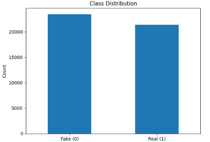
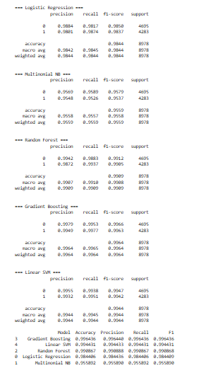
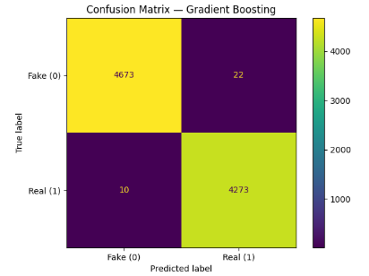
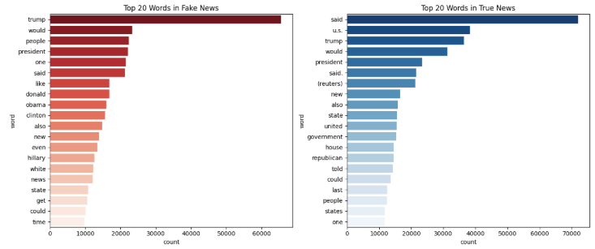
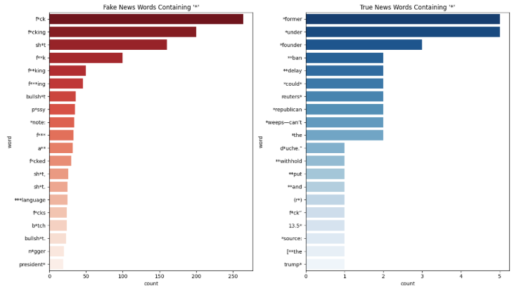
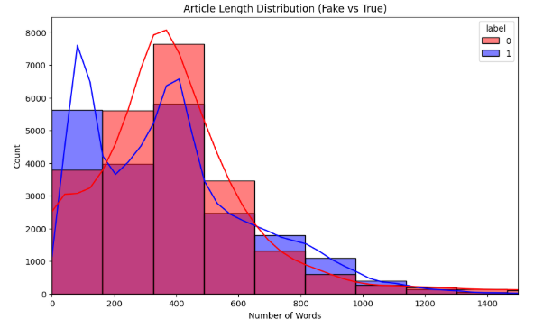

# 📰 Fake News Detection

**Author:** Muhammad Sharique Baig

[](https://www.python.org/)  
[](https://scikit-learn.org/stable/)  
[](https://streamlit.io/)  
[](LICENSE)

---

## 📌 Introduction

The rapid spread of misinformation through online news portals and social media has made **fake news detection** a major research challenge.  
This project aims to build a **machine learning model** to classify news articles as either **fake** or **real** using the _Fake and Real News Dataset_.

The dataset consists of news articles collected in the **United States (2015–2018)**, a politically charged period marked by the U.S. presidential election and its aftermath.

---

## ⚙️ Data Preprocessing

Steps taken to clean and prepare the dataset:

- **Text Cleaning:** Removed HTML tags, URLs, numbers, and punctuation.
- **Stopwords Removal:** Common words (e.g., _the, is, am_) were removed.
- **Lemmatization:** Reduced words to their base form (e.g., _running → run_).
- **Combined Features:** Merged article title and text for stronger features.

---

## 📊 Dataset Overview

The dataset contains a balance between **fake** and **true** articles.



---

## 🧩 Feature Engineering

- Used **TF-IDF Vectorization** with **unigrams and bigrams** (`ngram_range=(1,2)`) to represent articles.

---

## 🤖 Model Training & Evaluation

Trained and evaluated **five machine learning models**:

- Logistic Regression
- Multinomial Naïve Bayes
- Random Forest
- Gradient Boosting
- Linear SVM

Evaluation Metrics: **Accuracy, Precision, Recall, F1-score**

✅ **Gradient Boosting** was chosen as the final model (best F1-score).

  


---

## 🔎 Linguistic Analysis of Fake vs. Real News

### 1. Top 20 Most Common Words

- **Fake News:** _trump, president, obama, clinton, hillary_
- **True News:** _said, u.s., government, republican, house_



---

### 2. Swear Words & Offensive Language

- Fake news articles contained **500+ swear words**.
- True news articles contained only **~10 swear words**.

👉 Fake news relies more on **sensationalism, emotional appeal, and offensive language**.



---

### 3. Word Clouds

- **Fake News:** dominated by political figures’ names.
- **True News:** focuses on formal reporting terms (_said, state, u.s._).


---

### 4. Article Length Distribution

- **Fake News:** Shorter, quick attention-grabbing content.
- **True News:** Longer, detailed reporting.



---

## 📌 Key Findings

1. **Profanity as a Signal:** Fake news uses ~50x more swear words.
2. **Lexical Style:** Fake news emphasizes political figures & emotional hooks; true news emphasizes institutions & formal reporting.
3. **Article Length:** Fake news tends to be shorter.
4. **Model Accuracy:** Gradient Boost achieved strong accuracy & F1-scores, proving TF-IDF features are effective.

---

## 🚀 Streamlit App Integration (Work in Progress)

- Trained **TF-IDF vectorizer** and **best model** were saved using `joblib`:
  - `tfidf_vectorizer.joblib`
  - `best_model.joblib`

Planned features for Streamlit app:

- Input a news snippet.
- Predict **Fake (0)** or **Real (1)**.
- Highlight key words (e.g., profanity, political names) influencing the decision.

⚠️ _Yet to be implemented._

---

## 💻 How to Run

1. **Clone this repository**

   ```bash
   git clone https://github.com/ShariqueBaig/fake-news-detection.git
   cd fake-news-detection
   ```

2. **Install dependencies**

   ```bash
   pip install -r requirements.txt
   ```

3. **Run the jupyter notebook**

   ```bash

   ```

4. **Run Streamlit app (when available)**
   ```bash
   streamlit run app.py
   ```
